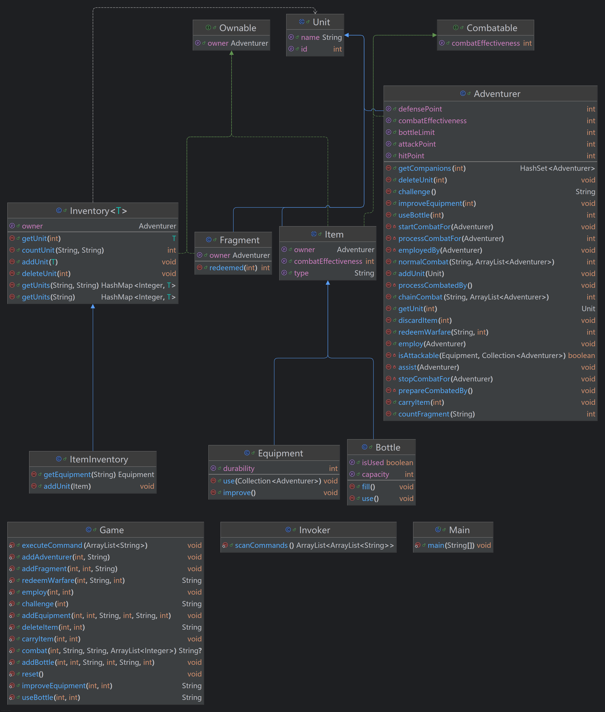

# BUAA-OOPre-2024-课程总结

## 一、架构设计

### （一）最终架构

### （二）迭代过程

#### 1. 第一代（继承和增删查改）

Unit 派生 CombatUnit，CombatUnit 派生 Adventurer 和 Equipment 和 Bottle，Bottle 派生 AtkBottle，DefBottle 和 Hpbottle。
Main 负责解析命令，Player 单例模式负责执行命令。

#### 2. 第二代（携带和使用物品）

##### （1）架构

Unit 派生 CombatUnit，CombatUnit 派生 Adventurer 和 Item，Item 派生 Equipment 和 Bottle。Inventory 是 Hashmap<Item> 的封装。
Main 负责解析命令，Player 单例模式负责执行命令。

##### （2）更改

Bottle 的不同类型由于差异不大且数量不多，由 type 属性承担，未使用工厂模式。

#### 3. 第三代（战斗与碎片兑换）

##### （1）架构

Unit 派生 Adventurer、Item 和 Frangment，Item 派生 Equipment 和 Bottle。Inventoy<T> 派生ItemInventory和UnitInventory。
Adventurer 和 Item 实现 Combatable 接口。
Main 负责解析命令，Player 单例模式负责执行命令。

##### （2）更改

UnitInventory 负责管理所有物品，ItemInventory 充当背包并覆写 add 方法限制携带。
Adventurer 和 Item 的战斗力计算方式不同，不宜继承自基类，实现get方法即可。

#### 4. 第四代（类型战斗与援助）

##### （1）架构

Unit 派生 Adventurer、Item 和 Frangment，Item 派生 Equipment 和 Bottle。Inventoy<T> 派生ItemInventory。
Adventurer 和 Item 实现 Combatable 接口，Item、Frangment 和 Inventoy<T> 实现Ownable接口。
Main 作为入口，Invoker 负责读入命令，Game 负责解析并执行命令，实现伪命令模式。

##### （2）更改

移除 UnitInventory 类的冗余封装，使用裸的 Inventory<Unit>，简化逻辑。
移除 Unit 的 owner 成员，让 Adventure 类不再拥有冗余成员，适应雇佣关系。需要相关逻辑的类实现get方法即可。
伪命令模式替代单例模式，降低 Main 类负担，增强可拓展性。

## 二、JUNIT心得

### （一）编写可单元测试的类

单例模式难以连续运行单元测试。除非提供 reset 方法，单元结束时调用，否则数据不会重置。

### （二）编写可单元测试的方法

类的方法需高内聚、低耦合，包括业务功能专一、调用层级清晰等，才可能按单元分别测试。
实际业务中不需要返回值的方法也要适当提供返回值，以便单元测试及手动调试。

### （三）注意覆盖率的可提升性

尽可能测试**所有分支**！对于不可能进入的分支，权衡可拓展性和覆盖率，适当使用断言消除分支。
需要控制台输入的方法无法单元测试。不要使用输入重定向，以免评测出现非法行为。

## 三、OOPre心得

### （一）从面向过程到面向对象

面向过程的编程范式是平铺式的，关注数据的流转。确定业务流程后，需要同时考虑多方面细节，适合自下而上编写。
通常方法是先实现各种程序函数，再封装为业务函数，最后连接数据通路。
缺点在于细节繁多，难以重构。

面向对象的编程范式是层级式的，关注数据的关系。确定业务架构后，只需考虑内部细节和有限的外部暴露，适合自上而下编写。
通常方法是先实现类和接口的继承关系，再填充属性并实现方法，直至完成层次调用。
程序与业务的分离可以通过设计模式，也可以通过抽象、类的多态和方法的覆写。
缺点在于统筹全局，极重设计。

### （二）从OOPre到OO

在 OOPre 中，学习 Java 程序设计与简单的设计模式，有意识的关注代码风格，进行单元测试。
此外还学习使用 Git 。提交的更改量要适度，还要编写清晰的提交消息，便于反思架构设计以及出错后回滚。
关键是学习面向对象的范式思想，学会架构设计并进行迭代开发，注重可拓展性并熟悉如何重构。
重点是本地**充分测试**，不要依赖于在线评测。

对于OO，还需掌握自动化测试，包括评测机搭建与数据生成。

## 四、课程建议

加入自动评测练习，如补全评测机代码，按要求生成有效数据等。
作业要求通常使人感受不到使用设计模式的必要性，没有相关迭代，且可抽象的部分不多，多数只是为了练习而使用。